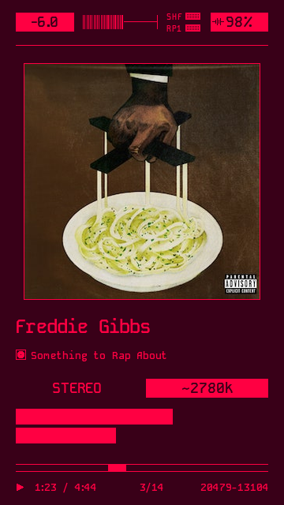
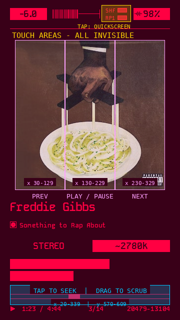
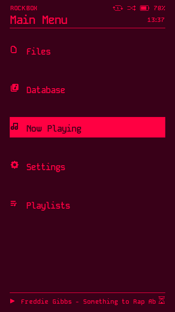
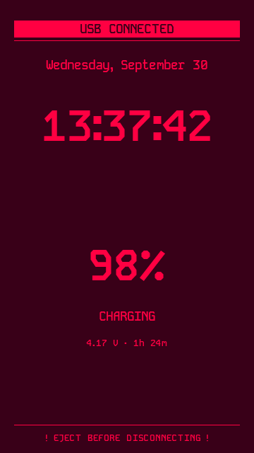

# SNARTX — HIDIZS AP80 Pro Max

The **SNARTX** Rockbox theme, laid out for the HIDIZS AP80 Pro Max (360×640 portrait).

Original theme by **Cody Mortensen (Tirim4, 2025)** — a spinoff of SNARTY by Simon Andén.
Licensed **CC-BY-SA 4.0**.

## Screenshots

Full renders at the device's native **360×640** — drawn from the theme's own fonts,
bitmaps and the coordinates the skin declares, the way the player draws it. Each file is
that size exactly; shown side by side at 220px each, click any one for the full-size
image.

| Now playing | Touch areas *(invisible)* | Main menu | USB / charging |
| :---: | :---: | :---: | :---: |
|  |  |  |  |

The bottom row is three slots, as the original theme had them: elapsed / total time
beside the play indicator, playlist position / track count in the middle, and the
peak-meter readout on the right.

The theme itself draws nothing in the touch-areas shot — those are the tap targets.
The menu shot uses a roomier row rhythm than the device draws: a preview-only mock-up,
the theme's own menu layout is unchanged.

## Install

1. Copy the package onto your microSD card so the `.rockbox` folder merges with the one
   at the card root.
2. On the player: **Settings → Theme Settings → Load Theme → SNARTX**.
3. For the touch controls: **Settings → General Settings → Display → Touchscreen
   Settings → Touchscreen Mode → Absolute Point**.

## Touch controls

Five invisible areas — they draw nothing, so every pixel stays exactly as it was.

| area | screen | action |
| :--- | :--- | :--- |
| album art — left third | x 30..129, y 80..379 | previous track |
| album art — middle third | x 130..229, y 80..379 | play / pause |
| album art — right third | x 230..329, y 80..379 | next track |
| progress bar band | x 20..339, y 570..609 | tap to seek, drag to scrub |
| shuffle / repeat cluster | x 203..261, y 10..43 | tap to open the quickscreen |

## Quickscreen

Everything on it is touchable:

| area | action |
| :--- | :--- |
| outer thirds of the screen | change the four settings |
| middle of the screen | exit |
| volume row — the 36px band around the bar | tap or drag to set the volume, same mapping as the bar |

Brightness keeps only the touch area Rockbox creates for its slider by itself — the theme
adds nothing there.

Rockbox only honours these in **Absolute Point** mode; in 3×3 Grid they are ignored.
Softlock blocks them, and Party Mode disables the three art zones. The `touchscreen mode`
line in `SNARTX.cfg` is left commented out — it is a device-wide preference, so the theme
does not force it.

## USB / charging screen

Plugged in, the screen shows the battery level in the clock's own type, the charging
state, the pack voltage and the time left to full. The band below the clock used to be
empty; it now carries that panel. Everything above and below it is untouched.

## Notes

- 360×640 portrait only — for the AP80 Pro Max, not the AP80 / AP80 Pro / AP80 Pro-X.
- Everything below the header rule is untouched from 1.0, pixel for pixel.
- Upgrading from 1.0: copy the package over the existing install. A
  `SNARTX-v1.0-to-v2.0.patch` is in the release if you would rather patch.
- The lock screen keeps its plain 8px bar; it is only on screen while the hold switch is.

Happy listening — and if you improve it, share alike (CC-BY-SA 4.0).
